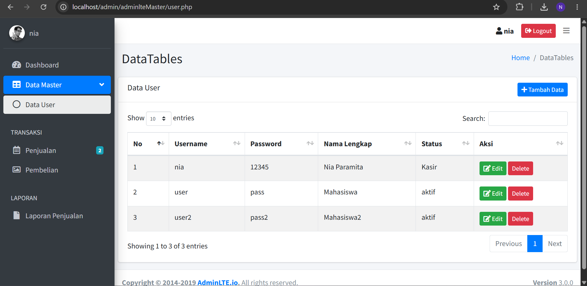

# PROJEK UAS PEMROGRAMAN WEB
nama : ni made nia paramita

nim: 2501010376

kelas: IF C

# Tampilan Login

# Dashboard

# Data User

# Data Produk

## Deskripsi
Project UAS Mata Kuliah Pemrograman Web menggunakan PHP Native, MySQL, dan AdminLTE.

## Fitur
- Login
- Logout
- Session
- Dashboard
- CRUD User
- CRUD Produk

## Tools
- PHP
- MySQL
- XAMPP
- AdminLTE
- DataTables

## Cara Menjalankan
1. Clone repository
2. Import database `db_toko.sql`
3. Jalankan XAMPP
4. Buka localhost
